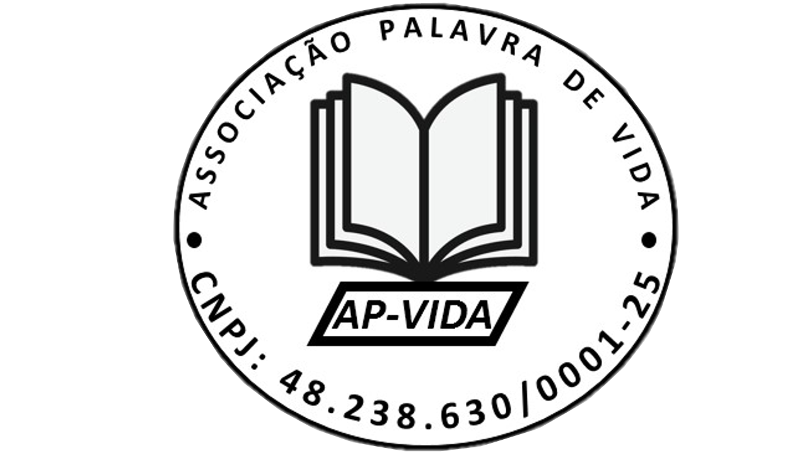

# Site Palavra de Vida

<!-- Sumário -->

  
Índice

  <ol>
    <li><a href="#projeto">Sobre o projeto</a></li>
    <li><a href="#estrutura">Estrutura do projeto</a></li>
    <li><a href="#tecnologias">Dependências e Tecnologias usadas</a></li>
    <li><a href="#link">Projeto online</a></li>
    <li><a href="#developers">Developer</a></li>
  </ol>

<h2 name="projeto"> Sobre o projeto </h2>

Este projeto será realizado pelo desenvolvedor <a href="https://github.com/Eliabe-Ribeiro-22">Eliabe Mota</a> com objetivo de ajudar uma **associação** civil de direito privado, de caráter beneficente, localizada na cidade de Lages, chamada Associação **Palavra de Vida**. 

Ela tem a meta de arrecadar fundos para adquirir literaturas a serem distribuídas gratuitamente e realizar atividades sociais a pessoas carentes. Por isso, ela é destinada a atender pessoas de todas as idades com literaturas educativas e promover o bem-estar social a todos.

Sua fundação foi em 2023. E já distribuiu mais de 100 Bíblia, apesar de ser tão recente.

Neste site o visitante consegue visualizar as ações desenvolvidas pela entidade, bem como a sua visão, missão, seu objetivo, seus valores e sua meta, assim como a história da associação.

Além disso, ele pode entrar em contato com a instituição através de um formulário apropriado, caso queira ser um sócio-contribuinte.

<h2 name="estrutura"> Estrutura do projeto  </h2>
O projeto é totalmente responsivo e segue a arquitetura REST.

Foi adicionado sistema de mensageria, dando assim a funcionalidade para o formulário de contato da associação.

Foi utilizado várias linguagens de programação para criação do site, a exemplo de PHP, JavaScript, HTML e CSS.

(<a href="#indice">voltar ao indice</a>)

## Tecnologias utilizados

- Laravel
- Arquitetura REST
- Envio de email, em que o visitante pode escolher se quer ser contactado por e-mail ou telefone
- CSS
- HTML
- JavaScript
- PHP
- Redirecionamento para What's do responsável pela instituição, quando o usuário clica no botão do What's App.

## Projeto no ar

Site online: <https://ap-vida.com>

(<a href="#indice">voltar ao índice</a>)

